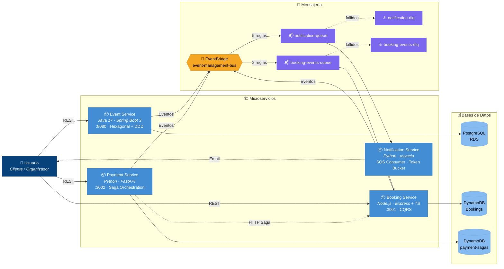

# Diagrama C4 — Plataforma de Gestión de Eventos Cloud-Native

## Nivel 2: Diagrama de Contenedores

Este documento describe la arquitectura a nivel de contenedores (C4 Level 2) de la
**Plataforma de Gestión de Eventos**, un sistema distribuido basado en microservicios
que implementa patrones de arquitectura cloud-native como Event-Driven Architecture (EDA),
CQRS, Saga Orchestration y Arquitectura Hexagonal.

---

### Diagrama de Contenedores



---

## Descripción de Componentes

### 1. Event Service — `Java 17 / Spring Boot 3` · Puerto 8080

| Aspecto | Detalle |
|---|---|
| **Patrón arquitectónico** | Arquitectura Hexagonal + Domain-Driven Design (DDD) |
| **Responsabilidad** | Gestionar el ciclo de vida completo de los eventos: creación, publicación y cancelación. |
| **Base de datos** | PostgreSQL (RDS) |
| **Eventos publicados** | `EventCreated`, `EventPublished`, `EventCancelled` → EventBridge |

### 2. Booking Service — `Node.js / Express + TypeScript` · Puerto 3001

| Aspecto | Detalle |
|---|---|
| **Patrón arquitectónico** | CQRS + Arquitectura Hexagonal |
| **Responsabilidad** | Gestionar las reservas de entradas para los eventos. |
| **Base de datos** | DynamoDB — Tabla `Bookings` con GSI `userId-index` y `eventId-index` |
| **Eventos publicados** | `BookingCreated`, `BookingConfirmed`, `BookingCancelled` → EventBridge |

### 3. Payment Service — `Python / FastAPI` · Puerto 3002

| Aspecto | Detalle |
|---|---|
| **Patrón arquitectónico** | Saga Orchestration Pattern |
| **Responsabilidad** | Orquestar transacciones distribuidas entre servicios. |
| **Pasos de la Saga** | `ReserveBooking` → `ProcessPayment` → `ConfirmBooking` → `SendNotification` |
| **Base de datos** | DynamoDB — Tabla `payment-sagas` |
| **Eventos publicados** | `PaymentConfirmed`, `PaymentFailed` → EventBridge |
| **Comunicación directa** | Llama a Booking Service vía HTTP para confirmar o cancelar reservas. |

### 4. Notification Service — `Python / asyncio` · Sin puerto HTTP

| Aspecto | Detalle |
|---|---|
| **Patrón arquitectónico** | Event-Driven Consumer (SQS Polling) |
| **Responsabilidad** | Consumir eventos desde SQS y enviar notificaciones por email (proveedor mock). |
| **Rate Limiting** | Token Bucket Algorithm |
| **Cola de entrada** | SQS `notification-queue` |
| **Cola de errores** | SQS DLQ `notification-dlq` |

---

## Infraestructura AWS (LocalStack)

| Recurso | Tipo | Descripción |
|---|---|---|
| PostgreSQL (RDS) | Base de datos relacional | Almacén persistente del Event Service. |
| DynamoDB `Bookings` | Base de datos NoSQL | Almacén del Booking Service con GSI `userId-index` y `eventId-index`. |
| DynamoDB `payment-sagas` | Base de datos NoSQL | Almacén de estado de sagas del Payment Service. |
| DynamoDB `EventAvailability` | Base de datos NoSQL | Tabla de disponibilidad de eventos para el Booking Service. |
| EventBridge `event-management-bus` | Bus de eventos | Bus central de eventos del dominio para comunicación asíncrona. |
| SQS `notification-queue` | Cola de mensajes | Cola que alimenta al Notification Service con eventos filtrados. |
| SQS `notification-dlq` | Cola de mensajes (DLQ) | Dead Letter Queue para mensajes del Notification Service. |
| SQS `booking-events-queue` | Cola de mensajes | Cola que alimenta al Booking Service con eventos de Event Service. |
| SQS `booking-events-dlq` | Cola de mensajes (DLQ) | Dead Letter Queue para mensajes del Booking Service. |
| CloudWatch Logs | Log groups | 4 grupos de logs centralizados (uno por servicio). |

---

## Patrones de Comunicación

### 🔁 Event-Driven Architecture (EDA)

Los microservicios se comunican de forma **asíncrona** a través de **Amazon EventBridge**.
Cada servicio publica eventos de dominio en el bus `event-management-bus`, y **7 reglas de
enrutamiento** dirigen los eventos relevantes a dos colas SQS:

```
Servicio → EventBridge (bus) → Reglas → SQS notification-queue  → Notification Service
                                      → SQS booking-events-queue → Booking Service
```

**Reglas hacia `notification-queue` (5):** PaymentProcessed, PaymentFailed, EventPublished, EventCancelled, BookingCreated.

**Reglas hacia `booking-events-queue` (2):** EventCreated, EventCancelled (para sincronizar disponibilidad).

Este enfoque garantiza un **acoplamiento débil** entre productores y consumidores de eventos.

### 🔄 Saga Orchestration (Payment Service)

El **Payment Service** actúa como **orquestador** de una saga distribuida que coordina
la reserva y el pago de entradas. Los pasos son:

1. **ReserveBooking** — Solicita al Booking Service reservar entradas.
2. **ProcessPayment** — Procesa el pago internamente.
3. **ConfirmBooking** — Confirma la reserva en el Booking Service vía HTTP.

Si algún paso falla, el orquestador ejecuta las **compensaciones** correspondientes
(cancelar reserva, revertir pago) para mantener la consistencia eventual del sistema.

```
Payment Service --HTTP--> Booking Service (reservar)
Payment Service            (procesar pago)
Payment Service --HTTP--> Booking Service (confirmar / cancelar)
```

### 📖 CQRS — Command Query Responsibility Segregation (Booking Service)

El **Booking Service** implementa **CQRS** separando las operaciones de escritura (comandos)
de las operaciones de lectura (consultas). Esto permite optimizar cada ruta de forma
independiente y escalar las lecturas sin afectar las escrituras.

- **Comandos**: Crear reserva, confirmar reserva, cancelar reserva.
- **Consultas**: Listar reservas por usuario (`userId-index`), listar reservas por evento (`eventId-index`).

---

## Flujos de Comunicación — Resumen

| Origen | Destino | Protocolo | Descripción |
|---|---|---|---|
| Usuario | Event Service | REST / HTTP | Crear, publicar y cancelar eventos. |
| Usuario | Booking Service | REST / HTTP | Crear y consultar reservas. |
| Usuario | Payment Service | REST / HTTP | Iniciar pagos (saga). |
| Event Service | EventBridge | Evento async | `EventCreated`, `EventPublished`, `EventCancelled` |
| Booking Service | EventBridge | Evento async | `BookingCreated`, `BookingConfirmed`, `BookingCancelled` |
| Payment Service | EventBridge | Evento async | `PaymentConfirmed`, `PaymentFailed` |
| Payment Service | Booking Service | HTTP directo | Confirmar o cancelar reservas (pasos de la saga). |
| EventBridge | SQS `notification-queue` | 5 reglas | Filtrar y redirigir eventos al Notification Service. |
| EventBridge | SQS `booking-events-queue` | 2 reglas | Enrutar EventCreated y EventCancelled al Booking Service. |
| SQS `notification-queue` | Notification Service | Polling (SQS) | Consumo asíncrono de eventos de notificación. |
| SQS `booking-events-queue` | Booking Service | Polling (SQS) | Consumo asíncrono de eventos de disponibilidad. |
| SQS queues | SQS DLQs | Redrive policy | Mensajes que exceden los reintentos. |
| Notification Service | Usuario | Email (mock) | Envío de notificaciones. |
