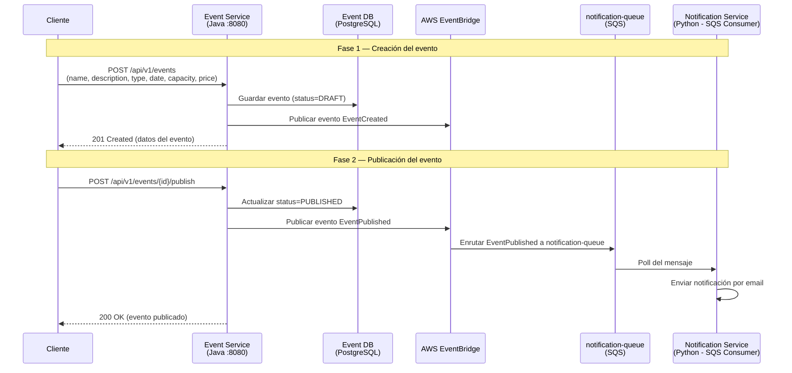
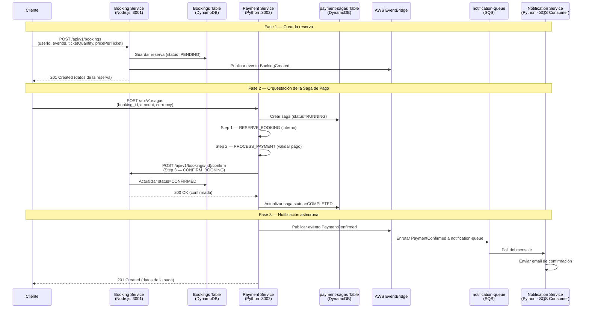
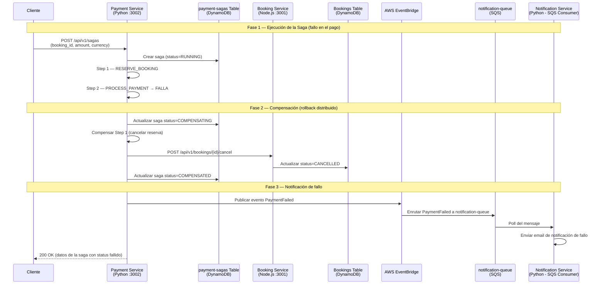
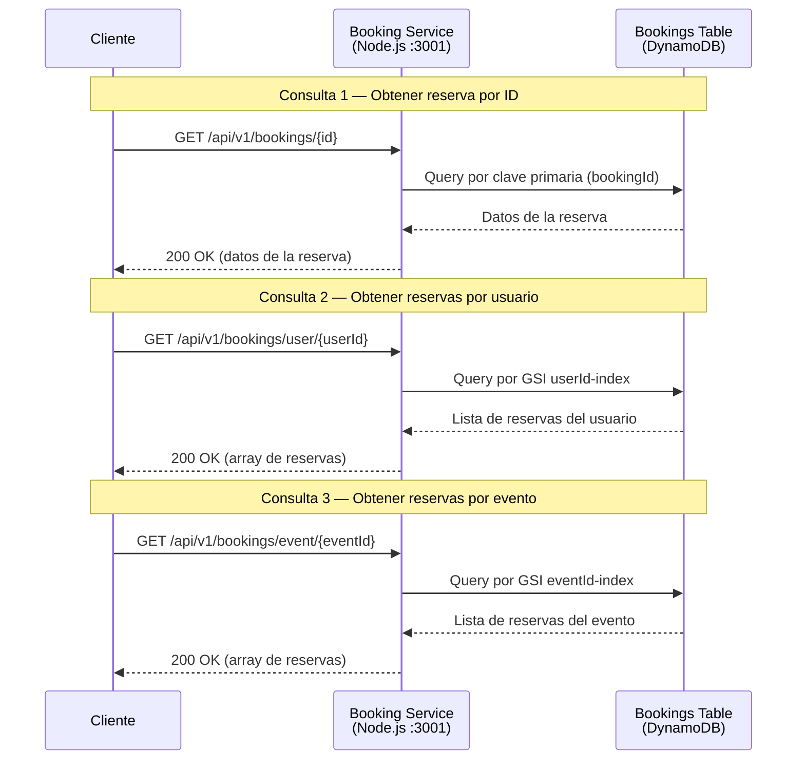

# Diagramas de Secuencia — Plataforma de Gestión de Eventos Cloud-Native

Este documento describe los flujos principales de la plataforma mediante diagramas de secuencia Mermaid. La arquitectura se basa en **Event-Driven Architecture (EDA)**, el patrón **Saga** para transacciones distribuidas y **CQRS** para separar lecturas de escrituras.

---

## Flujo 1: Crear y Publicar Evento

Este flujo ilustra el ciclo de vida de un evento, desde su creación en estado borrador hasta su publicación. Demuestra el patrón **Event-Driven Architecture (EDA)**: cada cambio de estado genera un evento de dominio que se propaga a través de EventBridge, permitiendo que otros servicios reaccionen de forma desacoplada.

> **Decisiones arquitectónicas clave:**
> - **EDA (Event-Driven Architecture):** Cada cambio de estado emite un evento de dominio, permitiendo acoplamiento débil entre servicios.
> - **Estado DRAFT → PUBLISHED:** El ciclo de vida en dos fases permite validar el evento antes de hacerlo visible.
> - **EventBridge como bus central:** Actúa como intermediario, enrutando eventos a las colas correspondientes mediante reglas declarativas.

---

## Flujo 2: Reservar Tickets — Happy Path

Este flujo muestra el camino exitoso de una reserva de tickets, orquestado por el **patrón Saga**. El Payment Service actúa como orquestador, coordinando los pasos de reserva, procesamiento de pago y confirmación de forma secuencial. Al completarse, se emite un evento de dominio que dispara la notificación al usuario.

> **Decisiones arquitectónicas clave:**
> - **Patrón Saga (orquestado):** El Payment Service coordina los pasos secuenciales, garantizando consistencia eventual entre servicios.
> - **Separación de responsabilidades:** El Booking Service gestiona el estado de la reserva; el Payment Service orquesta la transacción distribuida.
> - **Notificación desacoplada:** La confirmación al usuario se envía de forma asíncrona vía EventBridge → SQS → Notification Service.

---

## Flujo 3: Reservar Tickets — Failure Path (Compensación)

Este flujo muestra qué sucede cuando el procesamiento de pago falla. El **patrón Saga** ejecuta acciones de compensación en orden inverso para revertir los cambios parciales, garantizando la **consistencia eventual** del sistema. Este es un ejemplo clásico de gestión de fallos en arquitecturas distribuidas.

> **Decisiones arquitectónicas clave:**
> - **Compensación en orden inverso:** Si un paso falla, la saga deshace los pasos anteriores ejecutando las acciones compensatorias correspondientes.
> - **Estado COMPENSATING → COMPENSATED:** La saga registra cada fase de la compensación, permitiendo trazabilidad y recuperación ante fallos parciales.
> - **Notificación de fallo:** El usuario es notificado de forma asíncrona a través del mismo mecanismo de eventos, manteniendo la consistencia del flujo.

---

## Flujo 4: Consultar Reservas (CQRS Read)

Este flujo muestra el lado de **lectura** del patrón **CQRS (Command Query Responsibility Segregation)**. Las consultas se realizan directamente contra DynamoDB utilizando índices secundarios globales (GSI) optimizados para cada patrón de acceso, sin pasar por la lógica de escritura ni por el bus de eventos.

> **Decisiones arquitectónicas clave:**
> - **CQRS:** Las operaciones de lectura están completamente separadas de las de escritura, permitiendo optimizar cada lado de forma independiente.
> - **DynamoDB con GSI:** Los índices secundarios globales (`userId-index`, `eventId-index`) permiten consultas eficientes por diferentes patrones de acceso sin duplicar datos.
> - **Lecturas directas sin eventos:** A diferencia de los flujos de escritura, las consultas no generan eventos de dominio, reduciendo la latencia y la complejidad.
